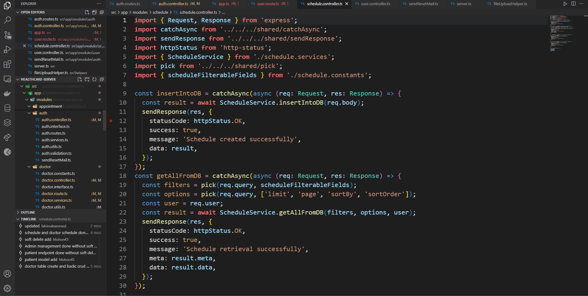
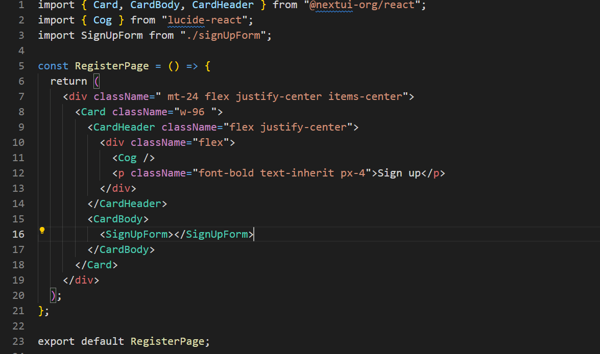
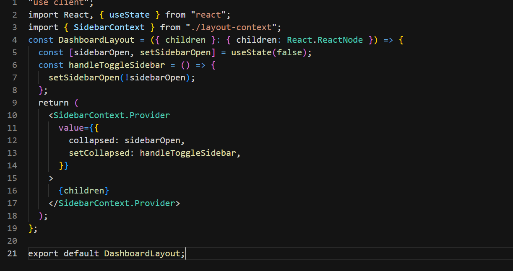
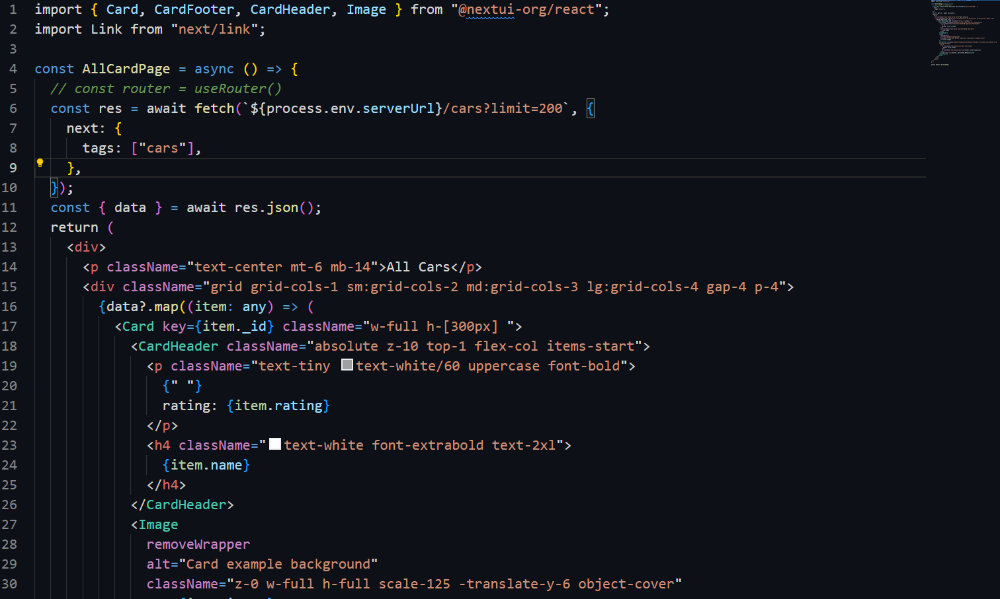

# Midnight Themes

A collection of dark themes optimized for midnight coding. This extension includes multiple themes with different styles to suit your preference.

## Themes Included

- **Dark Soft**: A gentle dark theme that's easy on the eyes.
- **Twilight**: A dark theme with a warm touch.
- **Midnight**: A deep dark theme for late-night coding.
- **Eclipse Midnight**: A soothing dark theme with peach accents.

## Installation

### Via Visual Studio Code Marketplace

1. Open **Visual Studio Code**.
2. Go to the **Extensions** view by clicking on the Extensions icon in the Sidebar (or by pressing `Ctrl+Shift+X`).
3. Search for `Midnight Themes`.
4. Click **Install** to install the theme.
5. Once installed, go to **Preferences** > **Color Theme** and select your preferred theme from the dropdown.

### Manual Installation

1. Download the latest release of `Midnight Themes` from the [GitHub releases page](https://github.com/mehedi-imun/MidnightThemesVsCode/releases).
2. Unzip the downloaded file.
3. Open **Visual Studio Code**.
4. Go to the **Extensions** view by clicking on the Extensions icon in the Sidebar (or by pressing `Ctrl+Shift+X`).
5. Click on the three dots in the upper right corner and select **Install from VSIX...**.
6. Navigate to the unzipped file and select the `.vsix` file to install.
7. Once installed, go to **Preferences** > **Color Theme** and select your preferred theme from the dropdown.

## Preview

### Eclipse Midnight

### Dark Soft

### Twilight

### Midnight

## Repository

The source code for this theme extension is available on GitHub: [Midnight Themes GitHub Repository](https://github.com/mehedi-imun/MidnightThemesVsCode).

## License

This extension is licensed under the MIT License.

## Author

Created by **Mehedi Imun Anik**.

- Email: mehediimun@gmail.com

## Contributing

Contributions are welcome! If you find any issues or have suggestions for improvements, feel free to open an issue or submit a pull request on the [GitHub repository](https://github.com/mehedi-imun/MidnightThemesVsCode).

## Feedback

If you have any feedback or run into issues, please reach out via the [GitHub repository](https://github.com/mehedi-imun/MidnightThemesVsCode) or email me at mehediimun@gmail.com.
